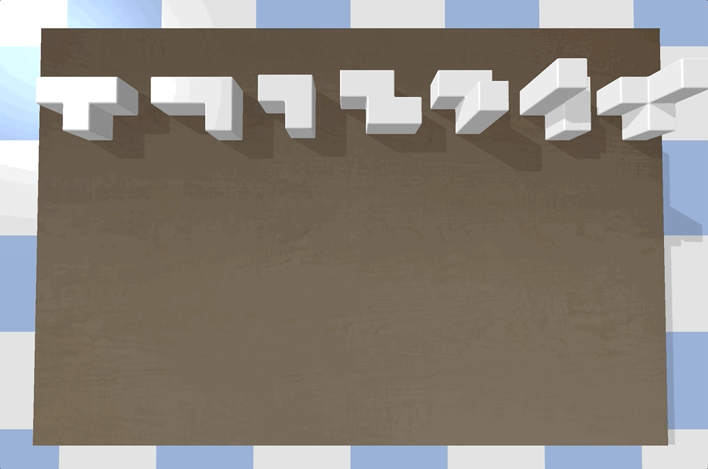

# PyBullet Simulator for Soma Cube Assembly
This is a simulation environment for Soma Cube Assembly based on PyBullet.

## URDF
URDF files are generated with `object2urdf`.

## PyBullet
Implemented the collision detection, stability check